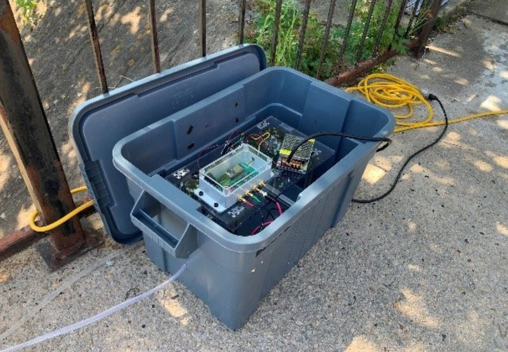

# Flow Through Water Quality Monitoring System

This system monitors water quality by measuring conductivity, pH, and temperature, ensuring continuous operation with minimal maintenance. Moreover, versions of this system enable the use of time-domain nuclear magnetic resonance to be performed in situ. It features a robust construction that protects electrical components from environmental damage, supports an adequate flow rate for in situ water sampling, and enables data transmission to a server for analysis.

Figure 1: flow-through water quality monitoring deployed at USC to monitor water quality in the Rocky Branch in Columbia South Carolina.

## System Development
Contains the hardware and software developed for the project. 

## Licensing and Citation

This work is licensed under a Creative Commons Attribution-ShareAlike 4.0 International License [cc-by-sa 4.0].

Cite this as: 

@Misc{ARTSLabFlowWaterQuality,    
  author = {ARTS-Lab},  
  howpublished = {GitHub},  
  title  = {Flow Through Water Quality Monitoring System},
  groups = {ARTS-Lab},    
  url    = {https://github.com/ARTS-Laboratory/flow-through-water-quality-monitoring-system},   
}

