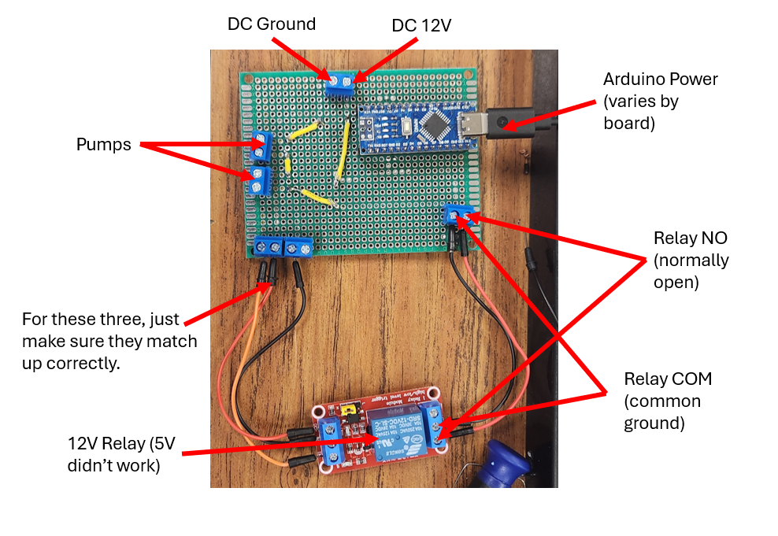

# V0.1

Hello! Hopefully the work I did here was somewhat helpful. If you have questions about any of the physical structure or the Arduino relay system, please feel free to contact me at the following:

bmontroy25@governors.school (will work until the end of may, 2025)
braedenmontroy1@gmail.com (will always work)
228-382-8652 (quickest answer)

Hey, this is Ali. I continued to work on the water sensor array after Braeden left. If you have any questions about that array you can contact me at aliwallam16@gmail.com

# Pumps
The pumps we are using are 12V Grothen pumps. You'll need about 2 amps to run both of them at full power at the same time.
(https://www.amazon.com/dp/B0863TCH65)

# Relay
I've left a picture of the relay labelled in the same folder as this. It should have everything you need to get this going. Currently, the system works by powering the pumps whenever the D13 on the Arduino is on. As I was leaving, we were working on making this output a switch toggle.

# Structure
The structure is currently made from 8020 and a sheet of what I think is Delrin. It doesn't fit in the box completely, as it needs about an inch to be chopped off the height in order to fit correctly, but all of the components fit inside of it. You can find CAD for this in the CAD folder in this directory. The next steps in terms of structure are to lower the right (or left) side to compensate for the PXIe, move all of the pumps to one side, use plastic screws and put the magnet on the other side, and make the connection between the pumps and the tubing and the sensor array watertight so water can actually run through the system.

# Water Sensor Array
Kit being used: https://atlas-scientific.com/kits/wi-fi-hydroponics-kit/

The array is now wired up to an SD card module as follows:
VCC (SD Card Module) to 3V (ESP32)
GND (SD Card Module) to GND (ESP32)
CS (SD Card Module) to GPIO 27 (ESP32)
MOSI (SD Card Module) to MOSI (ESP32)
MISO (SD Card Module) to MISO (ESP32)
SCK (SD Card Module) to SCK (ESP32)

The sensors themselves can take data and the code HFOIFHIOHFOIWHOW is set up to save the data to an sd card, they just need to be calibrated correctly to take data. The pH sensor currently connected to the array may not work together as it was not kept in the storage solution.

The kit is also connected to a TDS meter from keystudio: https://wiki.keyestudio.com/KS0429_keyestudio_TDS_Meter_V1.0

If you encounter issues they are likely power issues, in which case I would recommend adding a battery and a voltage regulator to the circuit.

